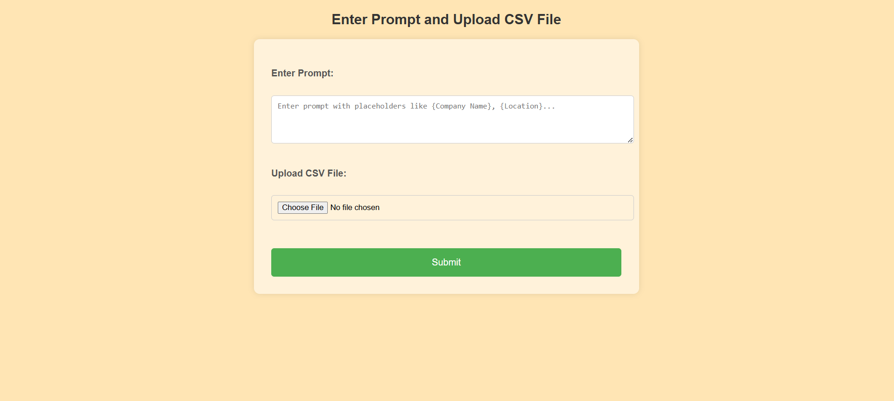

# Email Automation and Delivery Status Dashboard

This project is a Flask-based web application designed for customized email delivery using data from a CSV file. The app allows users to input a prompt with placeholders, upload a CSV containing recipient details, and generate personalized messages for each recipient using the Groq API. The emails are then sent via SendGrid, with delivery statuses tracked on a real-time dashboard.

## Features

- **Custom Prompt Processing**: Users can provide a prompt with placeholders (e.g., `{name}`, `{location}`) that will be replaced by values from each row in the uploaded CSV file.
- **Email Personalization**: Each email is customized for the recipient using the Groq API.
- **Email Sending with SendGrid**: Emails are sent using the SendGrid API.
- **Delivery Status Tracking**: The status of each email (Sent, Delivered, Opened, Bounced, etc.) is tracked and displayed on the dashboard.
- **Webhook for Real-Time Updates**: SendGrid webhook updates the delivery status of each email.
- **Dashboard Search**: Users can search for specific emails and view the status in the dashboard.

## Prerequisites

- Python 3.7 or later
- Flask
- Pandas
- Groq API Key
- SendGrid API Key

## Setup

1. **Clone the Repository**
   ```bash
   git clone https://github.com/PrathamSharma169/Automated_Ai_Generated_Email_Sender.git
   cd Automated_Ai_Generated_Email_Sender
   ```

2. **Install Dependencies**
   ```bash
   pip install -r requirements.txt
   pip install python-dotenv
   ```

3. **Environment Variables**
   - Create a `.env` file and add your Groq API Key and SendGrid API Key:
     ```plaintext
     GROQ_API_KEY=your_groq_api_key
     SENDGRID_API_KEY=your_sendgrid_api_key
     ```

## Usage

1. **Update app.py**
    - Update the email ID with your email ID in process function of app.py (Email ID should be same as used while making sendgrid api key)

2. **Start the Flask App**
   ```bash
   flask run
   ```

3. **Access the Application**
   - Visit `http://localhost:5000` to access the app interface.

4. **Enter Prompt and Upload CSV**
   - Input your prompt with placeholders (e.g., `{name}`, `{location}`).
   - Upload a CSV file containing email data, including a column for `email`.

5. **View Status**
   - After submission, view email statuses on the status page.
   - Use `/dashboard` to view the real-time delivery status of all emails.

## Webhook Setup (SendGrid)

To enable real-time status updates, configure SendGrid to send event notifications to your webhook endpoint:
1. Go to SendGrid’s dashboard and navigate to **Settings** > **Mail Settings** > **Event Webhook**.
2. Enter your webhook URL (e.g., `http://yourdomain.com/webhook`).
3. Select events to track, such as `Delivered`, `Opened`, `Bounced`, etc.

## File Structure

```plaintext
.
├── app.py                   # Main application file
├── templates
│   ├── form.html            # Form for uploading CSV and entering prompt
│   ├── status.html          # Displays status of each email sent
│   └── dashboard.html       # Dashboard to view real-time email delivery statuses            
└── README.md                # This README file
```

## Sample CSV File

The uploaded CSV file should contain a column named `email` for recipient email addresses, along with other columns that match the placeholders in your prompt.

**Example CSV:**
```csv
name,email,location
John Doe,johndoe@example.com,New York
Jane Smith,janesmith@example.com,Los Angeles
```

## Troubleshooting

1. **Webhook Issues**: Ensure that the webhook endpoint (`/webhook`) only accepts `POST` requests.
2. **Email Delivery**: If emails aren't delivered, check SendGrid’s event webhook for errors like `bounce` or `dropped`.

## License

This project is open-source and available under the [MIT License](LICENSE).

## Acknowledgments

- [Groq](https://groq.com/) for language model API.
- [SendGrid](https://sendgrid.com/) for email services.

